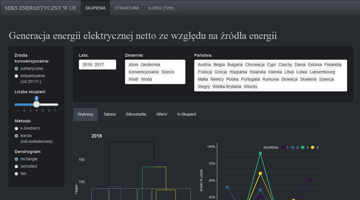
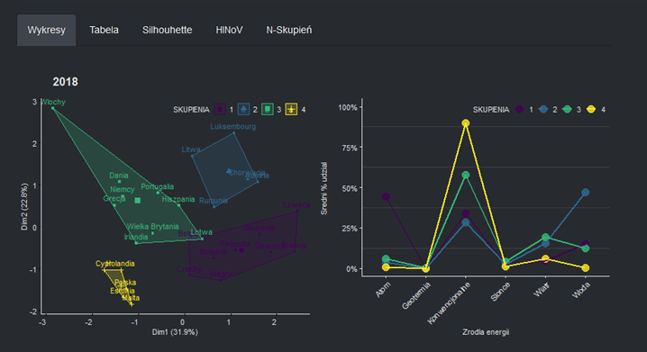
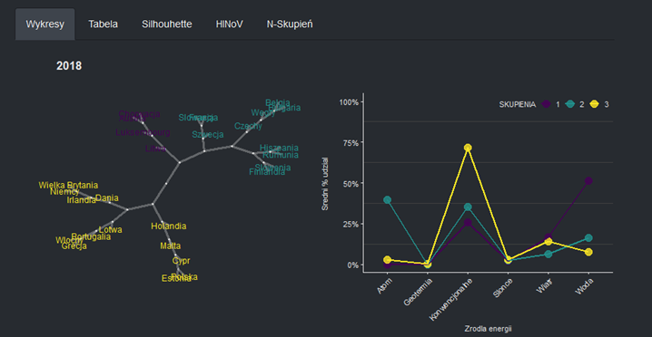
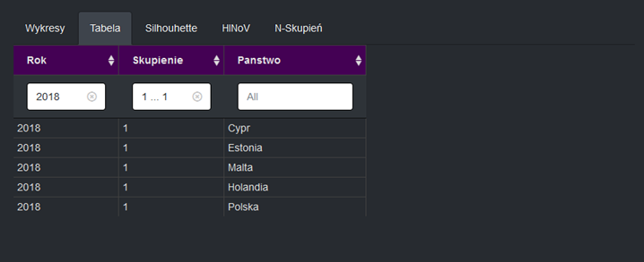
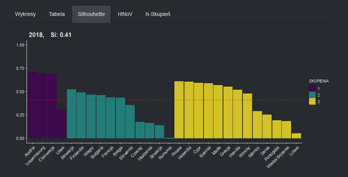
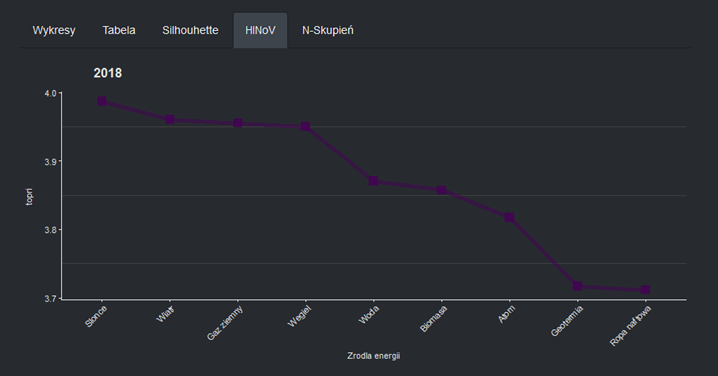
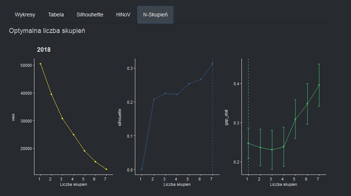
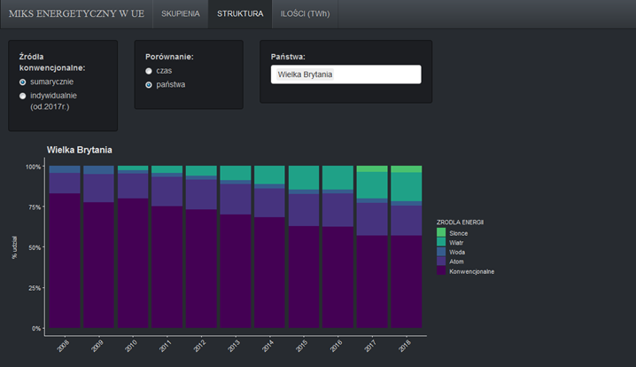
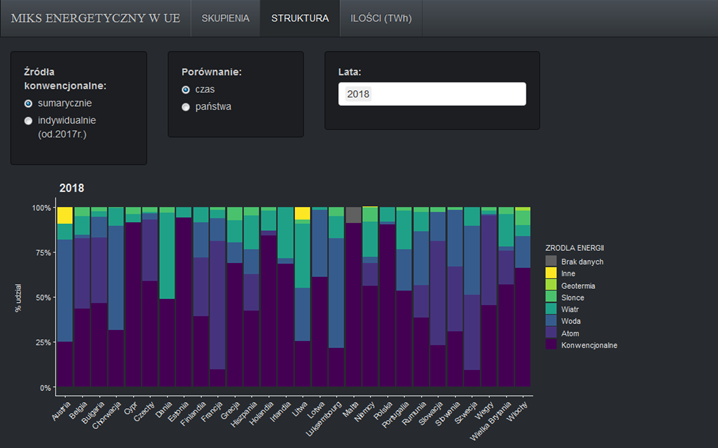
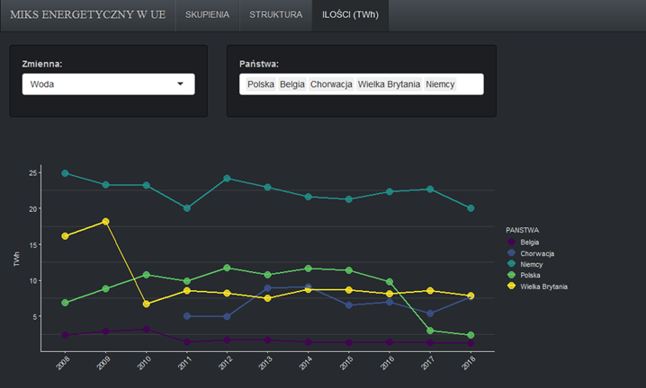

# Generacja energii elektrycznej w krajach UE ze względu na źródła energii

Aplikacja Shiny składa się z części:
* SKUPIENIA
* STRUKTURA
* ILOŚCI (TWh)

W części **SKUPIENIA** możemy wykonać analizę skupień w oparciu o metodę Warda i k-średnich. 
Aplikacja pozwala na manualny dobór optymalnej liczby skupień, analizowanych źródeł energii, czy państw UE. 

Efekty analizy skupień przedstawione są w zakładkach *Wykresy, Tabela, Silhouette*: 
* wykresy obrazujące wyodrębnione skupienia (dostępne są 3 formy prezentacji dendogramu),
* wykresy średnich % udziałów danych źródeł energii dla poszczgólnych skupień,
* tabela prezentująca państwa zakwalifikowane do konkretnych skupień,
* wykresy Silhouette,
* wykresy pozwalające wychwycić zmienne zakłócające,
* wykresy pomagające określić optymalną liczbę skupień.

**STRUKTURA** i **ILOŚCI (TWh)** są częściami pomocniczymi. 
Możemy zobaczyć jak prezentuje się struktura źródeł energii w przekroju czasowym dla danego kraju lub w przekroju państw dla danego roku. Dodatkowo aplikacja umożliwia porównanie wielkości generacji energii elektrycznej dla wybranych krajów.

Wszystkie wyniki uzyskane w aplikacji możemy wyświetlić jednocześnie dla wybranych przez nas lat. 
Dostępna jest też opcja wyboru sposobu uwzględnienia źródeł konwencjonalnych (idywidualnie/sumarycznie).

# 
**Źródło danych:** [Eurostat](http://appsso.eurostat.ec.europa.eu/nui/show.do?dataset=nrg_105m&lang=en)

**Inspiracje temetyczne:**
* *[Znamy już plany energetyczne wszystkich państw UE](https://wysokienapiecie.pl/17458-znamy-juz-plany-energetyczne-wszystkich-panstw-ue/)*, R.Zasuń, L.Kadej, wysokienapiecie.pl 
* *[Cała Europa pracuje nad zmianą źródeł prądu](https://www.obserwatorfinansowy.pl/forma/rotator/cala-europa-pracuje-nad-zmiana-zrodel-pradu/)*, R.Zasuń, obserwatorfinansowy.pl
* *Analiza struktury źródeł wytwarzanej energii państw Unii Europejskiej w latach 2002-2012*, K.Mazur, 
[w:] *Wybrane zastosowania narzędzi analitycznych w naukach ekonomicznych*, red. A.Prędki, Mfiles.pl, Kraków 2015

**Inspiracje techniczne:**
* [Dynamically generated user interface components](https://shiny.rstudio.com/gallery/dynamic-ui.html)
* [Dynamic number of plots](https://gist.github.com/wch/5436415/)
* [Tables (DT)](https://www.displayr.com/how-to-create-customized-tables-in-displayr-using-r/)
* [Tree Graph](http://www.gastonsanchez.com/visually-enforced/resources/2014/07/05/Pretty-tree-graph/)

**Przydatne linki:**
* [Google Fonts](https://fonts.google.com/?selection.family)
* [CSS - References](https://developer.mozilla.org/en-US/docs/Web/CSS)

